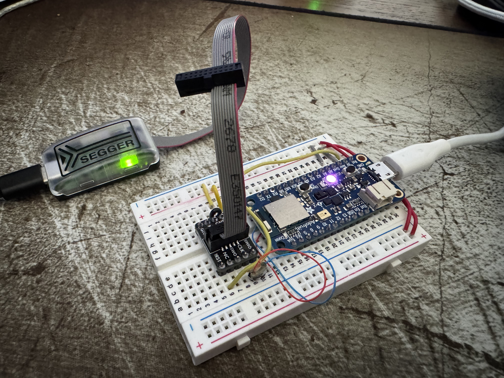
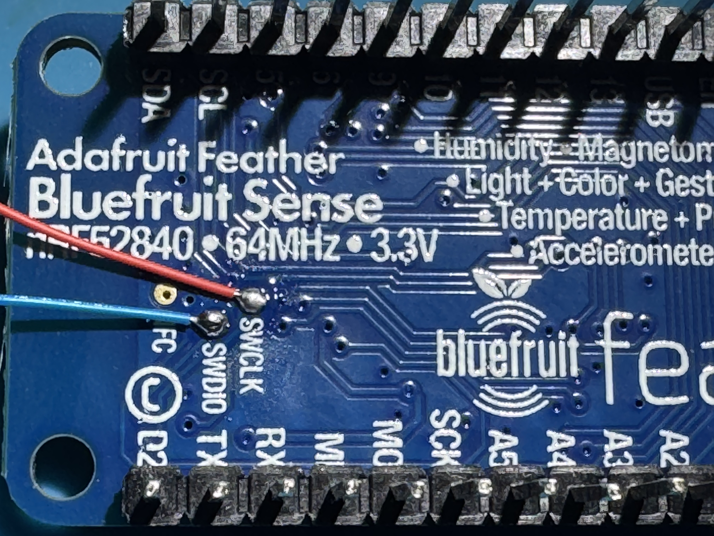
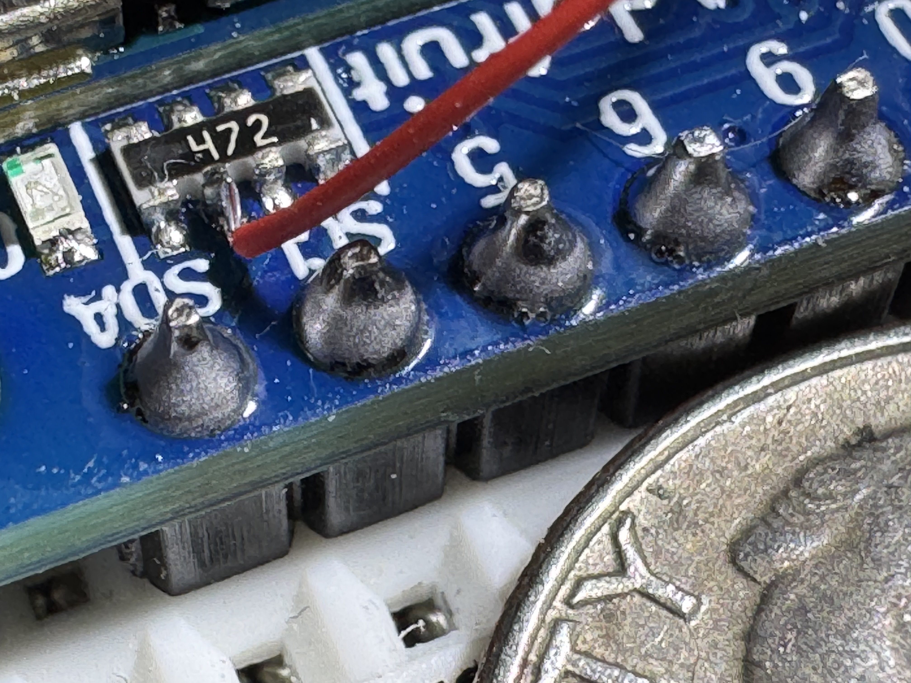

# R.A.P.T.O.R.
**Recoil Analysis & Precision Trigger Observation Recorder**

*(a Ballistic Recoil Tracking System)*

## Project Overview

Precision shooting is one of my favorite hobbies.  As is the case with most hobbies, it can be an endless journey of finding and purchasing (or building) items to continually make small forward gains – in this case - better rifles, better scopes, better ammo, tools for measuring things like bullet velocity and weather, etc.  However, at the end of the day, one common factor can make the difference between success and failure – the human.

Precision shooting involves shooting at longer distances – often over 500 yards.  At this distance, the common .223 bullet will drop approximately 5 feet and will see it’s velocity split in half, almost transitioning from super-sonic to sub-sonic.  Factors like spin drift will see a (generally right) curve.  Any small gust of wind, especially as the bullet slows, will shove the bullet far off course.  Finally, in most cases, it is nearly impossible to hold a scope on a target at those distances with little to no movement – just a heartbeat will move the scope several feet or more when shooting out that far.

As such, it can be very difficult to discern equipment troubles (a troublesome batch of ammo, some piece of the rifle not set up correctly) from other factors (gusts of wind, poor trigger control).    Failure to build a proper base (how the rifle and shooter are supported) can impact the amount of movement the rifle is subjected to.  Incorrect trigger technique can force movement on the rifle at the most critical time in the firing sequence.  

This project aims to remove some of the factors of shooting (bullet physics, environmental conditions) and isolate one particular aspect of the hobby – how steady is the shooter when the bullet goes off, and how is the rifle moving during that time.  These are aspects of shooting that can be improved with practice and time – and getting a good feedback loop for improving these can be a huge help.

## Commercial Examples

Some commercial examples of a system like this exist.  One of the most popular is the [Mantis X10 Elite Shooting Performance System](https://mantisx.com/products/mantis-x10-elite) – at approximately $249.  This device is mainly marketed as a dry-fire tool on pistols.  (using a laser cartridge indoors to practice draw and fire times as well as accuracy)  


The system is very capable, but the core concept is the ability to detect and quantify movement during the time of fire in the X/Z plane (up and down, left and right).  This can be used to compare different shooting platforms/techniques and can show progress over time if these things are improving.

While it would make sense from a practical “time spent” perspective to just purchase one of these devices, what fun would that be?  Let’s see what kind of results can be had using some cheap off-the-shelf electronic modules and a little bit of code.  A “DIY” recoil measurement system might be fun to have and build for many hobbyists.

## Architecture
### Requirements

Let’s start out with some basic requirements of a system like this:
- Microphone and IMU detection of the shot.
- Measure movement from just before the time of fire until just after the time of fire.[^1] 
- Upload data to a Bluetooth mobile app for display and multi-shot comparison.
- Battery powered – either small disposable or small rechargeable.
- 3d-printable enclosure, attachment via picatinny rail.
- High-precision– both in terms of movement accuracy and samples per second.

In addition, some nice-to-haves:
- LED indicator to show a shot was captured.
- Simple display to show preview of shot movement.
- Temperature, Barometric Pressure, Humidity measurements.
- Basic button(s) for on/off and sensitivity.

Stretch goals:
- Tilt sensor/tilt indication
- Full ballistic calculations on mobile app – enter target distance and allow the system to indicate an approximate “human shooter error” induced by movement.

[^1]:Assuming 3000fps muzzle velocity, a bullet takes between 1 and 1.5ms to travel the length of a typical barrel used in precision shooting.  However, it can take between 2.5 and 9.0 milliseconds for the trigger pull to activate ignition.  We should aim for recording the previous 50ms and the following 100ms of movement.

### Part Selection
#### Core Processor Choice: nRF52XXX

My typical go-to part for small projects such as this is the AVR family of microcontrollers – small, low power and relatively high clock rate, 3.3V and 5V compatible, UPDI programmable, loads of on-board features such as UARTs, Timers, and lots of configurability for external interrupts and analog/digital readings.  In addition, many of the parts in this family can be found in hand-solderable packages for easy prototyping and one-off custom PCB hand soldering.  The AVR128DA32 is one of my favorites and I’ve made several projects with this device.

However, given some of the requirements of this system, there are likely some better choices available.  Finding a part with built-in Bluetooth would be ideal – and something with even higher clock speeds (to measure the recoil as fast as possible) would be ideal.

After quite a bit of research, I settled on the nRF52XXX series of processors – for speed, power consumption, built-in features such as BLE, and availability.  They cost a bit more than my typical AVR parts, but are far more capable – I wouldn’t need to add (and worry about) external Bluetooth radio hardware, which is a big win.  It’s quite a bit faster (64MHz vs 24MHz) and is 32-bit (vs 8-bit).  It also has quite a bit more ram and flash, which will be useful for buffering gyro data before it gets sent to the mobile app.  It’s 3-4x more expensive than the part I typically like to use for prototypes – but the capability is more than worth it.

Most notably, this new part will require a different workflow.  I find the “drop a hex file in a directory” style bootloaders to be annoying and slow.  Instead, I’ll be purchasing a [SEGGER J-Link EDU Mini JTAG debugger](https://www.adafruit.com/product/3571) to aid in development.  Not only can this be used to program the device, but setting breakpoints will be a great departure from my typical “printf debugging.”

#### IMU/Gyro

Fortunately, with the explosion of small DIY drone development, there are many options for a gyro/accelerometer units (sometimes called an IMU or Inertial Measurement Unit).  

I have some limited experience with the LSM6 series of gyro/accelerometer[^2] – enough to get the basic idea of how it works and understand the general amount of noise it can produce and how hard it is to work with and get long-term stable readings.  Fortunately, for this project, relative movement is the most important aspect – not absolute orientation, so we can likely work around some noise.  This part has an advantage in that breakout boards are [readily available on amazon for a few bucks](https://www.amazon.com/NOYITO-Accelerometer-Gyroscope-Temperature-Interface/dp/B07K5LVMZ2). 

A much more ideal unit might be something like an ICM-42688.  Lower noise, higher sample rate, similar range of measurement.  Depending on the success of the LSM6, this could be an excellent future evolution.  Unfortunately, this part does not come in easily hand-solderable packages, and the links on amazon for breakout boards look a bit suspect, plus weeks to months out for shipping.  This could become a “when a real PCB gets designed, we add layouts for both parts and can solder one or the other on the PCB” kind of situation.  Until then, a breakout module from amazon on a breadboard will do nicely.

[^2]:I tested several gyro/accelerometer units when building an underwater digital compass system – attempting to get a “level reading” is important in that application.

#### Temperature/Humidity/Pressure

There are many different atmospheric sensors out there[^3] – all fairly accurate and almost all with some sort of noise filtering/smoothing.  In general, these tend to be factory calibrated (and can be re-calibrated by the end user) and as such they tend to be very close in performance to each other.  While these environmental factors are important, half a degree won’t change much, and these measurements are “nice to have” anyway.

[^3]:A previous project involved a x16 array of various I2C temperature/humidity/pressure sensors and studied drift and variance over time.  The results were insignificant in that the sensors tended to all be more than accurate enough for typical hobbyist needs.

#### Battery/Power

This device needs to run for an entire day of shooting, with time to spare.  Ideally, this would be 8-12 hours.  Indicator LEDs and OLED displays can be put to sleep after 30ish seconds and as such are not a power concern.    The big X-factor is “how much BLE data will be transmitted.”  It’s unclear how much power this will require, and if power spikes will result from this transmission.  For now, including a small LiPo pack will be the go-to answer, but a later version with a small form factor disposable battery (a single AAA?) is definitely a desire.  Alternately, a 10440 rechargable lithium cell (same size as AAA) would be a good option so charging electronics can be left out of the system, and users can supply their own spare batteries.

### Was this part built specifically for this project???

As I was researching some of the nRF52XXX modules available on amazon, I stumbled upon the Adafruit Feather nRF52840 Sense for $39.50

This fantastic little module is the size of two postage stamps and includes:
- 1MB Flash, 256K RAM
- BLE (Bluetooth Low Energy)
- LSM6 Series Accelerometer/Gyro
- PDM Microphone/Sound Sensor
- SHT30 and BMP280 for Temperature/Humidity/Pressure
- NeoPixel LED
- Exposed I2C/TWI lines (for future expansion)
- Exposed SWD debug ports (for JTAG programming/debugging)
- Reset and User Button

Most of these auxillary parts are connected to the main processor via I2C/TWI.  The breakout board has dedicated pins for hardware I2C, SPI, and UART peripherals.  The UART in particular will be handy when working towards bluetooth data transfer. 

#### Adafruit Feather nRF52840 Links
- [Store Link](https://www.adafruit.com/product/4516)
- [Adafruit Feather nRF5280 Sense Startup Guide](https://learn.adafruit.com/adafruit-feather-sense)
- [Pinout](https://cdn-learn.adafruit.com/assets/assets/000/110/594/original/sensors_Adafruit_Feather_nRF52840_Sense_pinout.png)
- [Schematic](https://cdn-learn.adafruit.com/assets/assets/000/127/209/original/sensors_schem.png)
- [Debug Header for Breadboard JTAG Connection](https://www.adafruit.com/product/2743)
- [Base nRF52XXX Feather](https://www.adafruit.com/product/4062)

The IMU here isn't ideal - but would be a good starting point.  Using an off-the-shelf unit like this will get the project kicked off quickly so building a custom system on a base nRF52XXX unit won't be a barrier to exploring this project.

#### Adafruit Feather nRF52840 Part Links:

| Part Id | Part Name | Datasheet | Breakout Purchase Link |
|-----------|---------|-----------|------------------------|
| Microcontroller | nRF52840 | [Main Page](https://www.nordicsemi.com/Products/nRF52840)<br>[Datasheet](https://mm.digikey.com/Volume0/opasdata/d220001/medias/docus/6470/NRF52840-QFAA-F-R.pdf) | [Feather Express](https://www.adafruit.com/product/4062)<br>[ItsyBitsy](https://www.adafruit.com/product/4481) |
| LSM6DS3TR-C | IMU/Gyro | [Datasheet](https://cdn-shop.adafruit.com/product-files/4503/4503_LSM6DS3TR-C_datasheet.pdf) | [Module](https://www.adafruit.com/product/4503) |
| MP34DT01-M | PDM MEMS Microphone | [Datasheet](https://cdn-learn.adafruit.com/assets/assets/000/049/977/original/MP34DT01-M.pdf) | [Module](https://www.adafruit.com/product/3492) |
| SHT30 | Temperature/Humidity | [Datasheet](https://cdn-shop.adafruit.com/product-files/5064/5064_Sensirion_Humidity_Sensors_SHT3x_Datasheet_digital.pdf) | |
| BMP280 | Temperature/Pressure | [Datasheet](https://cdn-shop.adafruit.com/datasheets/BST-BMP280-DS001-11.pdf) | [Module](https://www.adafruit.com/product/2651) |
| WS2812B | NeoPixel RGB LED Module | [Datasheet](https://cdn-shop.adafruit.com/datasheets/WS2812B.pdf) | [Module](https://www.adafruit.com/product/5975) |
| MP34DT01-M | PDM Microphone | [Datasheet](https://cdn-learn.adafruit.com/assets/assets/000/049/977/original/MP34DT01-M.pdf) | [Module](https://www.adafruit.com/product/4346) |


## Putting It All Together
The development environment...
<p align="center">

</p>

### Attaching JTAG
The Arduino nRF52840 Feather Sense does not come with a convenient JTAG port, unlike some of its cousins also available at Adafruit and other retailers.  Fortunately, it does expose a couple of small copper pads (on the bottom of the board, SIGH).  These two pads, as well as +V, GND, and Reset, make up the bulk of what the Segger J-Link JTAG wants in order to program/set breakpoints/debug.  I used wire-wrap wires and a two pin header I had laying around, plus some hot-glue to stabilize the exposed connections.

<p align="center">

</p>

### Bootloader

Updating the bootloader on these parts is typically the first order of business.  In my case, the part was on 0.8.0, which satisfied some of the “careful, you must be beyond this version” verbiage in the guide.  That being said, a later version was available, so I upgraded.  It was as simple as connecting the feather sense to USB and dropping a new UF2 file into the USB drive that appeared.  The part rebooted and indicated in a local text file that it had been upgraded.

Later on, I managed to brick the feather, and wanted to run the bootloader for some reason or another.  While the Adafruit page lists direct links to the latest UF2 bootloader, a hex file is necessary to reprogram the device via JTAG.  A [link from the Adafruit site to the github pages](https://github.com/adafruit/Adafruit_nRF52_Bootloader/releases/tag/0.10.0) allowed me to find the “feather_nrf52840sense_bootloader-0.10.0” hex file easily.

### Development Environments

#### CLion + PlatformIO

I’m a huge fan of JetBrains products, and while the Arduino IDE has come a long way, it still feels purpose-built for single-file prototypes, and many of the helpful coder tools are missing.  Some of their refactor tools and coding suggestions make programming more enjoyable and reduce errors.  I’ve had a lot of success getting CLion to work with the AVR128DA32 projects I’ve done.  However, after spending many hours trying to bend CLion and PlatformIO to my will[^4] and make it talk to the Feather Sense, I admitted defeat, closed CLion, and started following the actual manual for installation and development.  I’m still sore about this, and don’t promise to never revisit this topic.

[^4]:Many of the steps I used involved installation of nordic’s toolchain (west, zephyr) and a python environment set up to use those tools.  At the end of the day, it struggled to deal with my installation toolchain being in C:\ and my project directory in D:\.  I did manage to build and deploy some simple programs but it was onerous and difficult to work with – the opposite of what I’m looking for.

#### Arduino IDE

Installation here involved adding links to additional board managers (the Adafruit github) and installing some tools specific to the nRF52.  Caution should be taken – there are several variations of the feather and not all of them are compatible with all of the samples or libraries.  At the end of the day, I was able to get some simple hello-world style LED blinking light applications to work successfully.  But, once again, this development environment is not super ideal.

#### Visual Studio Code

Many years ago, I used Visual Studio (and sometimes Visual Studio Code) extensively.  It wasn’t super refined, and I gradually migrated over to JetBrains products for my professional daily tasks.  I haven’t really gone back, unless you count “oops windows opened visual studio by accident to inspect that CPP file.”  I didn’t have super high hopes.

PlatformIO integration has really been well done.  Installation was a snap.  Refreshing the platformio.ini file to modify project options or add library dependencies was almost automatic.  

The feather sense is supported by nordic’s nRF Connect Visual Studio plug-in.  This is exposed as a “folder icon” on the left bar of the screen and is where you start new projects.  This opens a wizard and sets up the basic template of your PlatformIO project, specific to the feather board you’re using.

In addition, I installed the JLink extensions, which gave me the ability to upload compiled code via JTAG and set breakpoints with only a few minor additions to the platformio.ini file.

## Building a Prototype

### Using AI

In the past, I’ve been stalwart on my desire to “do everything myself.”  I typically use AI only for stand-alone utilities where the definition of the problem and end goal is relatively simple and the implementation could be complex – purely as a time-saver/annoyance limiter.

However, during a recent deep-dive into setting timers on an AVR128DA32, I found myself 5 hours in to interrupt triggering logic not working and very annoyed.  Out of frustration (or desperation, you decide) I dumped the entire 600 page PDF into ChatGPT and told it to make me C code that would give me an interrupt trigger every X milliseconds using Timer2.  I had low hopes – that’s a big document and I didn’t give it many hints.  To my surprise and delight, it got the task right on the first shot.  

This time around I decided to go all-in.  I've spent days and weeks building classes and libraries over the years, and feel pretty comfortable that I can do it again - but if there's a faster way and I still need to debug and modify it in the end to my liking - why not?

I started by asking ChatGPT how do build individual modules, feeding it source files and letting it make changes back and forth with me.  This got me about 60% of the way done, and never got me to 100% the way I wanted it to work. There were always bugs that were difficult to diagnose and fix and the AI eventually got so slow it was taking over 5 minutes to answer questions.

I'd never used Claude, but had heard good things and decided to give it a shot.  Once you agree to [Anthropic's $20/mo Pro plan](https://claude.com/pricing), you are granted the ability to use [Claude Code](https://support.claude.com/en/articles/11145838-using-claude-code-with-your-pro-or-max-plan), which is required to be able to co-develop directly in editor with [Anthropic's Claude Code for VS](https://code.claude.com/docs/en/vs-code) plugin.

My first attempt at a prototype built with Claude didn't go perfectly.  The code produced wasn't ideal, functional, complete, or generally fixable without a complete rewrite.  By the time I got to attempting to debug and fix within VS and the Claude plug-in, I'd run out of "time" and got shut down for the day.  (apparently this happens after a few hours or some amount of AI processing, and more expensive plans get you more processing time before this happens)

On my second attempt, I had a great deal more success.  Some googling (and asking ChatGPT about Claude lol) told me that I needed to do things in smaller chunks.  Get one module done at a time, close the claude window, and when I started a new module, let Claude re-scan all my files from scratch.  Apparently the long chat history can really bog down AI's thinking.

### Building Modules

#### IMU (Gyro/Accelerometer)

The IMU on the feather has a couple of really neat features that make my recoil sensing application really interesting.
- It can detect taps (like tapping a watch or a phone to wake it)
- It can continuously collect data into a FIFO buffer which can be read and cleared all at once.
- It can run in a "Continuous to FIFO" mode - so it will continuously sample until a trigger condition is met and then it will keep the event data in memory.
- It has an external interrupt wired to the nRF52840.

It took a bit of time to get the external interrupt firing - there are several versions of the schematic and PCB floating around and unfortunately the PCB is not labeled as to what version it actually is.  Eventually I was able to trace the external interrupt line to a resistor network that I could carefully solder a wire-wrap wire onto, which allowed me to use a logic analyzer to debug.  

<p align="center">

</p>

This allowed me to verify that I had both the IMU firing when it detected an event, and also troubleshoot the pin/port/line confusion of the arduino environment.  As usual, it was some mismatch of pin numbers to interrupt numbers to use of helper functions to translate from and to things.

 ```
     attachInterrupt(digitalPinToInterrupt(IMU_INT1_PIN), imuISR, RISING);
 ```

Once the external interrupt was firing, I was able to tune the system to record at fastest possible speed - 6.66kHz - so the sample window was approximately 50ms and 341 samples.  Since I'm more interested in (mostly) what happens after the impact event (recoil) I'm saving 40ms of the window for after the event, and 10ms for before the event.  Depending on what kind of data I see, it may be necessary to lower the sampling rate so the timing window is wider, but that will be a future experiment under "more realistic" conditions.

#### NeoPixel

I don't want anything super fancy at first - just something that says "hey I got a sample, I'm saving it, I'm transferring it to the mobile app, ...".  The multi-color NeoPixel works great for that.  After Claude decided to write some interesting early-return type loop functionality, I gave the instruction to use "a real state machine with the following states: ...".  Once we got over that hump, results improved.

Claude didn't do so well understanding that the NeoPixel library on Arduino has 0 and the brightest, 1 as the dimmest, and 255 as the "almost brightest."  So basically ... 0 is "really really bright."  Some manual code updates later, and everything works great.  When an impact is detected, the LED goes from green (resting) to red (impact) to blue (transferring data) and then fades back to green (resting again).

#### Atmospheric Sensors

I've written a bunch of sensor libraries over the years, and have a recipe for what I like.  In this case, I wanted a setup() and loop() function, and I wanted the sensors configured in "as accurate/oversampled" as possible.  I didn't want anything interrupt driven, and I wanted the readings to be continuously sampled and cached so I could read the stored values inline with other performance code.

In practice, the atmospheric data is read at the end of an event and will be part of the event data sent to the mobile phone.

#### PDM Microphone

In addition to impact sensing, the system will also listen for very loud sounds (like a nearby hand clap) and treat this just like an impact from the external interrupt.  Either the IMU or PDM can trigger a dump of the gyro/accel data.  The PDM (Pulse Density Modulated) sensor converts sound signals to a clock-driven output (1-3MHz) that will match the sound wave coming in.
<p align="center">

</p>

Adafruit once again has [a great write-up on how these devices work](https://learn.adafruit.com/adafruit-pdm-microphone-breakout/overview).  From my perspective, I just need a trigger when a loud noise is present, and it works great for that.

## Sample Output

### Direct Terminal Debug

The console output is long (400 lines each event).

Header:

```
IMU: armed (Continuous ring-buffer mode, 6.66 kHz)
IMU: trigger detected
IMU: cap->drain  OR=Y TO=N  S2=0x60 S1=0x0 FC5=0x51
IMU: draining ~341 samples
IMU: gravity bias  bX=-0.103 bY=0.019 bZ=10.084  (74 pre-event samples)

--- Recoil Event Captured ---
dt_us,ax_ms2,ay_ms2,az_ms2,gx_rads,gy_rads,gz_rads
-10961,0.2225,-0.0429,0.0279,-0.0086,-0.0147,-0.0611
-10811,0.0693,0.0911,-0.0103,0.0220,-0.0293,0.0574
-10661,0.0167,0.0528,0.0375,0.0293,-0.0293,-0.0220
-10511,0.0167,0.1150,-0.0008,-0.0012,-0.0293,-0.0293
-10361,-0.0982,0.0433,-0.0247,-0.0086,-0.0293,0.0415
-10211,0.0885,0.2060,-0.0247,0.0293,-0.0293,-0.0452
-10061,-0.0934,0.1677,0.0184,-0.0244,-0.0293,-0.0134
-9911,-0.0312,-0.1290,-0.0343,0.0220,-0.0293,-0.0134
```
The Impact Event:
```
-461,-0.0790,0.1773,0.0519,0.0073,0.0012,0.0110
-311,-0.1077,0.0528,0.0088,0.0147,-0.0147,-0.0134
-161,-0.1795,0.1438,-0.0295,0.0073,0.0159,0.0257
-11,0.1411,-0.0142,-0.0391,0.0379,-0.1063,-0.0134
139,-0.0503,0.1485,0.0375,0.0073,0.0086,-0.0525
289,-0.1125,-0.0477,0.0136,0.0452,-0.0757,0.0342
439,-0.7969,-0.0620,-0.1300,0.0073,0.0159,-0.0525
589,-5.5825,0.6606,-0.4602,-0.0464,0.0244,0.0024
739,-7.7408,-0.1577,-0.2831,-0.0012,-0.0061,0.0574
889,-9.3584,0.2060,-0.1683,0.0452,0.0159,0.0660
1039,-12.7275,0.7133,-0.2975,0.0379,-0.0452,-0.0134
1189,-13.8569,0.1294,-0.3788,0.0525,0.0391,0.0733
1339,-18.0874,0.4500,-0.7091,-0.0159,-0.0452,0.1454
1489,-24.0168,0.3639,-0.7186,-0.1087,-0.0599,0.1295
1639,-29.2092,0.4357,-0.5703,-0.0623,0.1014,0.2236
1789,-34.5357,0.3830,-0.3118,-0.0855,0.1319,0.3103
1939,-40.6469,0.6415,-0.4411,-0.0318,0.1014,0.3348
2089,-48.7347,0.2969,-0.8670,-0.0550,0.1014,0.3824
2239,-55.2144,1.0578,-0.5655,-0.0464,0.1319,0.4765
2389,-63.1155,0.1725,-0.4315,-0.1625,0.0929,0.5950
2539,-70.0930,-2.0241,-0.0247,-0.1319,0.1552,0.6903
2689,-74.2039,-1.8327,0.5926,-0.2395,0.2541,0.7611
2839,-78.7120,-3.1918,0.6549,-0.1161,0.2700,0.8332
2989,-85.3162,-4.1633,1.2148,-0.2309,0.2700,0.8650
```
The end of the event list, plus atmospherics:
```
39589,4.6588,-0.7033,0.1572,-0.0550,-0.0831,-0.5351
39739,4.1850,-0.5262,0.1715,0.0220,-0.0525,-0.4007
39889,4.4051,-1.0431,0.2768,-0.0318,-0.1674,-0.4166
40039,4.7258,-0.7703,0.3390,-0.0159,-0.0990,-0.4875
# samples: 341
--- End of capture ---

SHT30 : Temp=27.3C (81.2F)  Humidity=36.6%RH
BMP280: Temp=27.2C (80.9F)  Pressure=965.21 hPa (28.5026 inHg)
IMU: armed (Continuous ring-buffer mode, 6.66 kHz)
```

### Excel Visualization

The impact shown in the data above and graph below was from a hard tap in the X-direction to the wired prototype board.

<p align="center">

</p>

## Next Steps

Now that the system seems to be putting out data well, the next steps are to bundle that data up into a nice SLIP packet to be transmitted over bluetooth to a mobile device (or laptop for the time being).  

To be continued...

